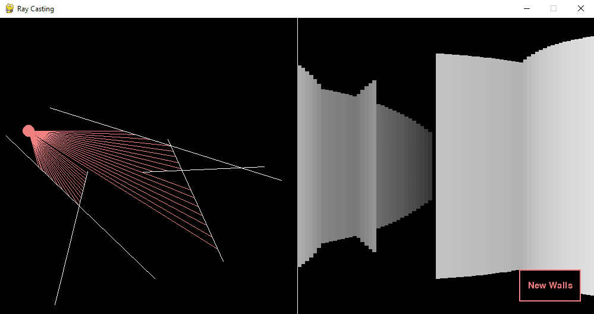
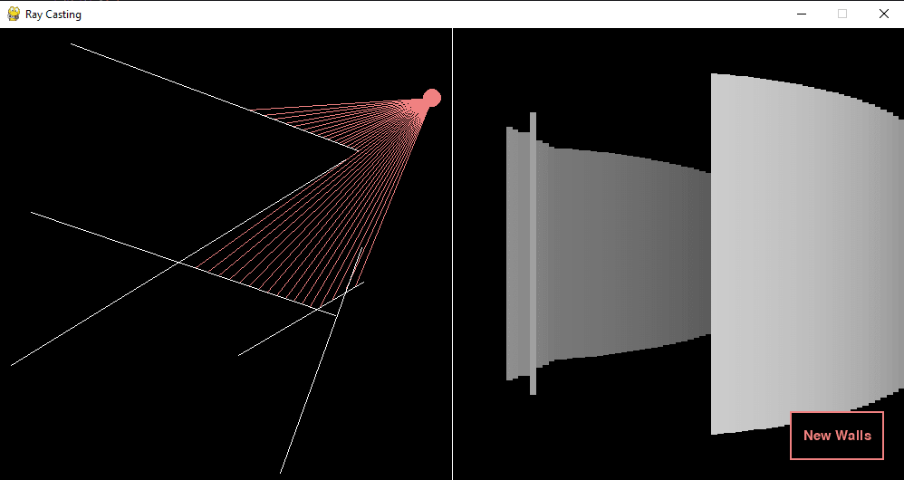

# Ray-Casting
This is a simple ray casting render made using Python and Pygame.

# Instructions
The light particle in the left window will follow your cursor (until the boundary). The light particle can be rotated clockwise by pressing the right arrow key and it can be rotated anti-clockwise by pressing the left arrow key. The keys `A` and `D` can also be used to rotate the particle in a similar fashion. You can press the button in the bottom right corner of the screen to generate a new set of walls.

# Demo Images



# Requirements
This project used Pygame and Numpy. After creating a virtual environment in your desired directory run the following command in your shell: \
```pip install -r requirements.txt```

# Credit/Sources
This project was heavily inspired by The Coding Train's videos on ray casting. Please follow these links to his videos on [2D Raycasting](https://www.youtube.com/watch?v=TOEi6T2mtHo) and [Rendering Raycasting](https://www.youtube.com/watch?v=vYgIKn7iDH8).
